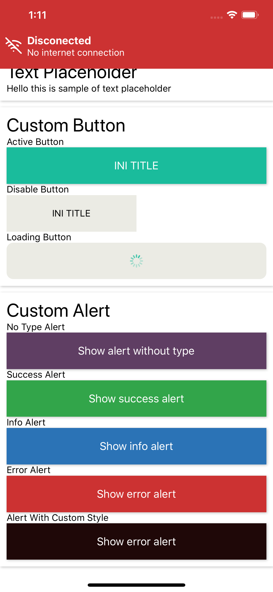
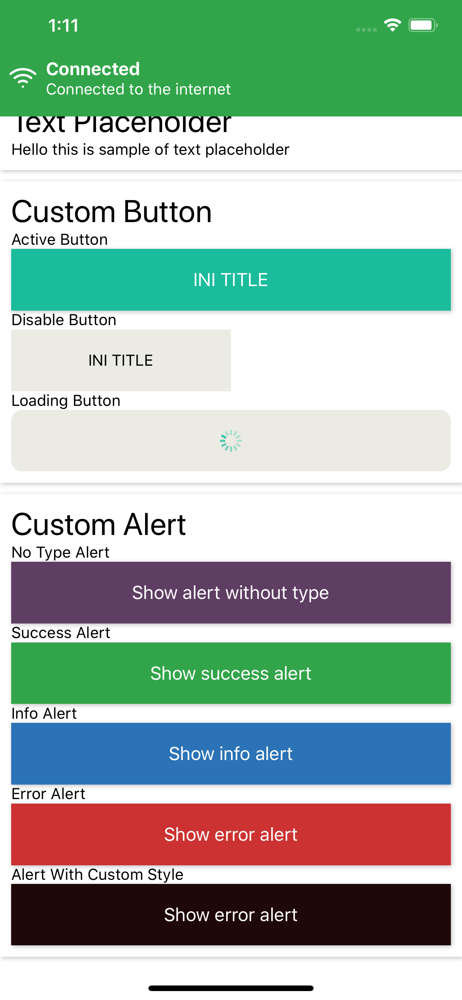

## ConnectionHandler
This is Connection Handler component, to inform user that internet connected or disconnected.

Connected | Disconnected   
--- | --- 
 |  

**How to use**

```javascript
import {ConnectionHandler} from 'react-native-awesome-component'

render() {
    return (
      <View style={styles.applicationView}>
        <ConnectionHandler/>
        <StatusBar barStyle='light-content' />
        <ReduxNavigation />
      </View>
    )
  }
```
**Props**

Props | Description | Default  
--- | --- | --- 
onChangeState: function | props to get state change (connected / disconnected) from component as boolean | - 
