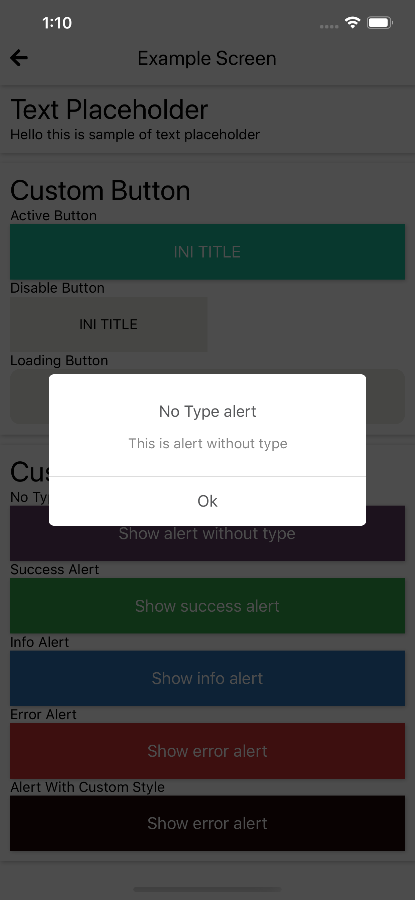
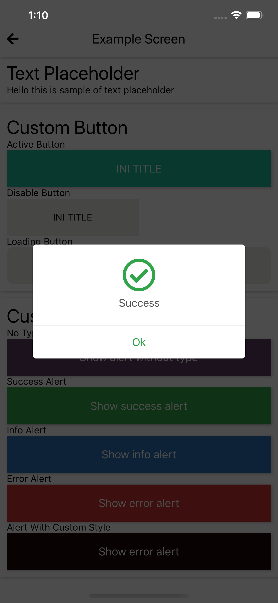
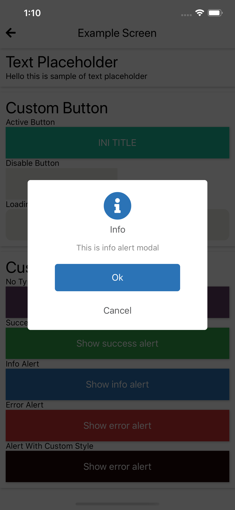
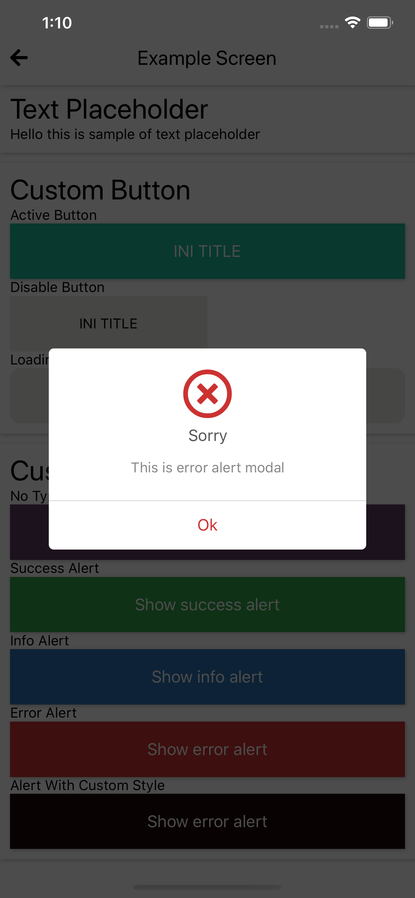
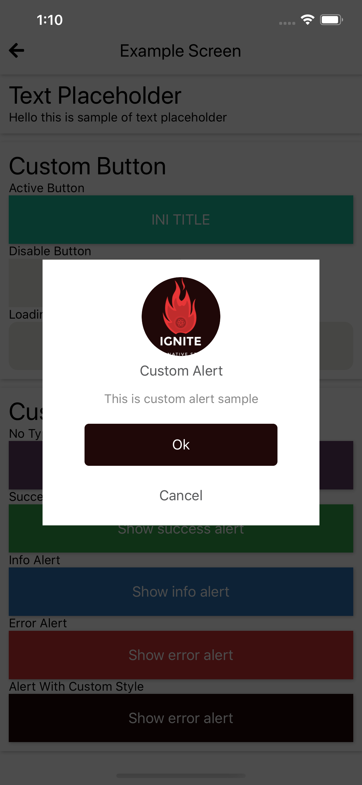

## CustomHeader
This is custom alert component, to help you inform to user. For more information about how to show / hide this alert component check this [link](../doc/method.md#alert-handler).

### A. props and usage
#### usage
```javascript
/**
 *  Add CustomAlert to your RootContainer.js
 */

import { CustomAlert } from 'react-native-awesome-component'

render() {
  return (
    <View style={styles.applicationView}>
      <CustomAlert
        iconType={'material-community'}
        iconSuccessName={'check-circle'}
        iconInfoName={'alert-circle'}
        iconErrorName={'close-circle'}
        iconSuccessSize={50}
        iconInfoSize={50}
        iconErrorSize={50}
        iconSuccessStyle={{ color: Colors.slateGrey }}
        iconInfoStyle={{ color: Colors.lightNavy }}
        iconErrorStyle={{ color: Colors.pastelRed }}
        titleStyle={{ fontFamily: Fonts.type.OpenSans.regular }}
        customConfiguration={{
          enableDismiss: false,
          successColor: Colors.lightNavy,
          errorColor: Colors.pastelRed,
          infoColor: Colors.lightNavy,
        }}
        containerStyle={{
          borderRadius: 5
        }}
      />
      <StatusBar barStyle='light-content' />
      <ReduxNavigation />
    </View>
  )
}
```

how to show the alert check documention below [here](../doc/custom-alert.md#b-outputs-params-and-how-to-show).

#### props

```javascript
// AlertType = 'success' | 'error' | 'info'

//ICustomAlertConfiguration (Alert options object)
ICustomAlertConfiguration = {
  type: AlertType, // success | info | error | custom-confirm. if value undefined it will show alert without top image / icon
  iconType: undefined, // it use to replace current alert icon type
  iconName: undefined, // it use to replace current alert icon name
  iconSize: undefined, // it use to replace current alert icon size
  iconStyle: {}, // it use to replace current alert icon style
  imgError: undefined, // image path (require(./)). if value undefined it will show default success icon
  imgSuccess: undefined. // image path (require(./)). if value undefined it will show default info icon
  imgInfo: undefined, // image path (require(./)). if value undefined it will show default error icon
  successColor: string, // color hex / name
  errorColor: string, // color hex / name
  infoColor: string, // color hex / name
  title: string, // alert title
  message: string, // alert message, if value undefined it wont render
  // if it dont have cancel or cancel is undefined it will only return one button, else it will show two button.
  confirm: {
    title: string, // button title
    callback: () => void // buntton callback on pressed
  },
  cancel: {
    title: string, // button title
    callback: () => void // buntton callback on pressed 
  },
}

//ICustomAlertStyleConfiguration: (Alert options custom style) [OPTIONAL]
CustomAlertProps = {
  containerStyle: {}, // view style
  titleStyle: {}, // text style
  iconType: string, // it use to set default icon type `(ant-design, entypo, evil-icons, feather, font-awesome, font-awesome5, fontisto, foundation, ionicons, material-community, material-icons, octicons)` | `font-awesome5`
  iconSuccessName: string, // it use to set default icon success name 
  iconInfoName: string, // it use to set default icon info name
  iconErrorName: string, // it use to set default icon error name
  iconSuccessSize: number, // it use to set default icon success size
  iconInfoSize: number, // it use to set default icon info size
  iconErrorSize: number, // it use to set default icon error size
  iconSuccessStyle: StyleProp<ImageStyle>, // it use to set default icon success style
  iconInfoStyle: StyleProp<ImageStyle>, // it use to set default icon info style
  iconErrorStyle: StyleProp<ImageStyle>, // it use to set default icon error style
  messageStyle: {}, // text style
  imageStyle: {}, // image style
  singleButtonContainerStyle: {}, // view style
  singleButtonTitleStyle: {}, // text style
  multiButtonContainerStyle: {
    confirm: {}, // view style
    cancel: {}, // view style
  },
  multiButtonTitleStyle: {
    confirm: {}, // text style
    cancel: {}, // text style
  },
  customConfiguration: ICustomAlertConfiguration // (same as option);
}

```

Props | Description | Default  
--- | --- | --- 
enableDismiss: boolean | props to enable / disable dismiss onpress backdrop | false 
containerStyle: StyleProp<ViewStyle> | props to set style of alert container | {} 
iconType: string; | props to set default icon type `(ant-design, entypo, evil-icons, feather, font-awesome, font-awesome5, fontisto, foundation, ionicons, material-community, material-icons, octicons)` | `font-awesome5`
iconSuccessName: string | props to set default icon success name | `check-circle`
iconInfoName: string | props to set default icon info name | `info-circle`
iconErrorName: string | props to set default icon error name | `times-circle`
iconSuccessSize: number| props to set default icon success size | 50
iconInfoSize: number | props to set default icon info size | 50
iconErrorSize: number | props to set default icon error size | 50
iconSuccessStyle: StyleProp<ImageStyle> | props to set default icon success style | {}
iconInfoStyle: StyleProp<ImageStyle> | props to set default icon info style | {}
iconErrorStyle: StyleProp<ImageStyle> | props to set default icon error style | {}
titleStyle: TextProps | props to set style of alert title | {} 
messageStyle: TextProps | props to set style of alert message | {} 
imageStyle: ImageStyle | props to set style of alert image | {}
singleButtonContainerStyle: StyleProp<ViewStyle> | props to set style of single button container | {} 
singleButtonTitleStyle: TextProps | props to set style of single button title | {} 
multiButtonContainerStyle: ICustomAlertMultiButtonStyle | props to set multy button container style | -
multiButtonTitleStyle: ICustomAlertMultiButtonStyle | props to set multy button container style | -
customConfiguration: ICustomAlertConfiguration| props to set default modal configuration | -

### B. outputs, params and how to show
#### 1. no type alert
> This is an alert without icon / image, check the params and output below for more detail.

```javascript
import { Method } from 'react-native-awesome-component'

/**
 * NO TYPE ALERT PARAMS
 */
const CUSTOM_ALERT_NO_TYPE_OPTION = {
  enableDismiss: false,
  type: undefined,
  imgSuccess: undefined,
  successColor: Colors.banner,
  title: 'No Type alert',
  message: 'This is alert without type',
  confirm: {
    title: 'Ok',
    callback: () => null
  },
}

Method.AlertHandler.showAlert(CUSTOM_ALERT_NO_TYPE_OPTION)
```

 

___

#### 2. success type alert
> This is an alert using default success type, check the params and output below for more detail.

```javascript
import { Method } from 'react-native-awesome-component'

/**
 * SUCCESS ALERT PARAMS
 */
const SUCCESS_ALERT_OPTIONS = {
  enableDismiss: false,
  type: 'success',
  imgSuccess: undefined,
  successColor: CustomColor.alertSuccess,
  title: 'Success',
  // message: 'This is success alert modal',
  confirm: {
    title: 'Ok',
    callback: () => null
  },
}

Method.AlertHandler.showAlert(SUCCESS_ALERT_OPTIONS)
```


___

#### 3. info type alert
> This is an alert using default info type, check the params and output below for more detail.

```javascript
import { Method } from 'react-native-awesome-component'

/**
 * INFO ALERT PARAMS
 */
const INFO_ALERT_OPTION = {
  enableDismiss: false,
  type: 'info',
  imgInfo: undefined,
  infoColor: CustomColor.alertInfo,
  title: 'Info',
  message: 'This is info alert modal',
  confirm: {
    title: 'Ok',
    callback: () => null
  },
  cancel: {
    title: 'Cancel',
    callback: () => null
  }
}

Method.AlertHandler.showAlert(INFO_ALERT_OPTION)
```

 

___

#### 4. error type alert
> This is an alert using default error type, check the params and output below for more detail.

```javascript
import { Method } from 'react-native-awesome-component'

/**
 * ERROR ALERT PARAMS
 */
const ERROR_ALERT_OPTION = {
  enableDismiss: false,
  type: 'error',
  imgError: undefined,
  errorColor: CustomColor.alertError,
  title: 'Sorry',
  message: 'This is error alert modal',
  confirm: {
    title: 'Ok',
    callback: () => null
  },
}

Method.AlertHandler.showAlert(ERROR_ALERT_OPTION)
```



___

#### 5. custom style type alert
> This is an alert using default custom style type, check the params and output below for more detail.

```javascript
import { Method } from 'react-native-awesome-component'

/**
 * NO TYPE ALERT PARAMS
 */
const CUSTOM_ALERT_OPTIONS = {
  enableDismiss: false,
  type: 'success',
  imgSuccess: Images.clearLogo,
  successColor: Colors.background,
  title: 'Custom Alert',
  message: 'This is custom alert sample',
  confirm: {
    title: 'Ok',
    callback: () => null
  },
  cancel: {
    title: 'Cancel',
    callback: () => null
  }
}

const CUSTOM_ALERT_STYLE = {
  imageStyle: {
    width: 90,
    height: 90,
    borderRadius: 45,
    backgroundColor: Colors.background
  },
  containerStyle: {
    borderRadius: 0,
  }
}

Method.AlertHandler.showAlert(CUSTOM_ALERT_OPTIONS, CUSTOM_ALERT_STYLE)
```



___


