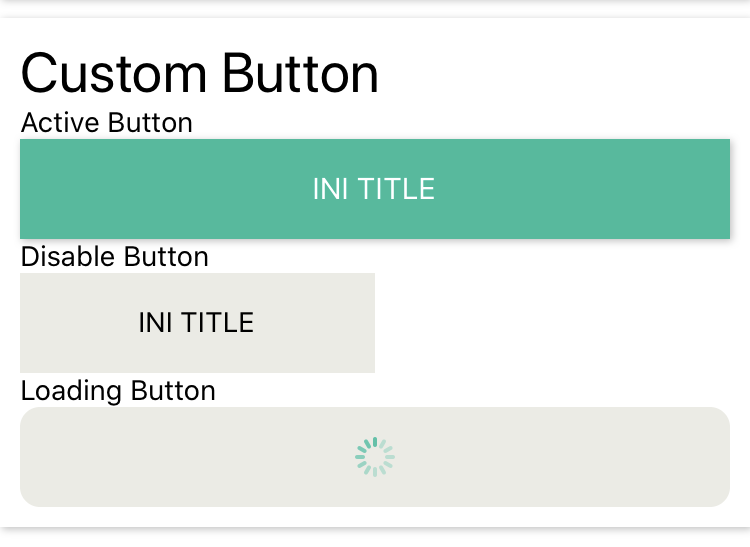

## CustomButton
This is Button with default style and condition.



**How to use**

```javascript
import {CustomButton} from 'react-native-awesome-component

return(
  <CustomButton
    title='INI TITLE'
    isCard
  />
)
```
**Props**

Props | Description | Default  
--- | --- | --- 
loading: boolean | props to set/show button loading | `false` 
disabled: boolean | props to disable button | `false` 
title: string | props to set button title | `'Button Title'` 
onPress: () => void | props to handle onPress button | `() => null` 
activeColor: string | props to set active button color | `#1abc9c`
disabledColor: string | props to set disable button color | `#EBEBE4`
width: number | props to set button width | -
height: number | props to set button height | `50`
radius: number | props to set button radius | -
borderWidth: number | props to set border width | -
borderColor: string | props to set border color | -
containerStyle: `StyleProp<ViewStyle>` | props to set style of button | -
activeTitleStyle: TextProps | props to set active title color | `#FFFFFF`
disableTitleStyle: TextProps | props to set disable title color | `#000000`
loadingColor: string | props to set button loading color | `#1abc9c`
isCard: boolean | props to set button as card / set shadow | false
