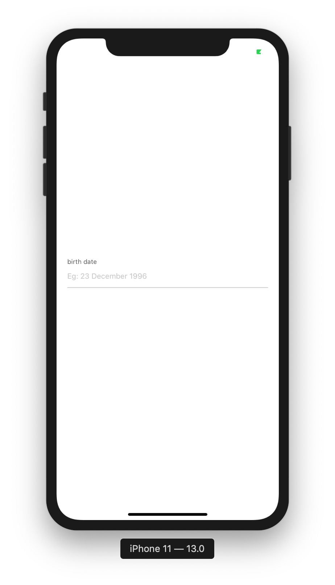
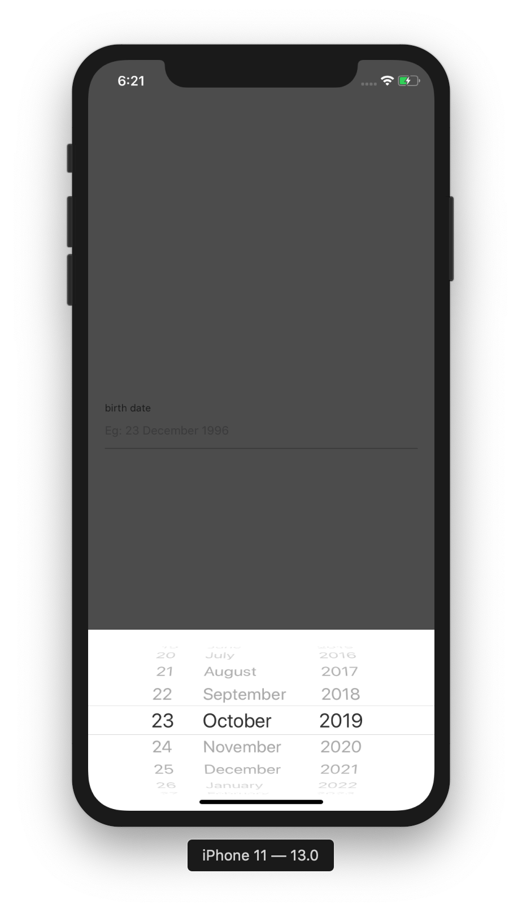

## CustomDatepicker

This is Datepicker component that using iOS like UI for Android/iOS.




**How to use**

```javascript
import { CustomDatepicker } from "react-native-awesome-component";

return (
  <CustomDatepicker
    isRequired
    label="birth date"
    value={selectedDate}
    placeholder="Eg: 23 December 1996"
    onDateChange={date => {
      // do something with date
    }}
  />
);
```

**Props**

| Props                              | Description                                                                                     | Default                |
| ---------------------------------- | ----------------------------------------------------------------------------------------------- | ---------------------- |
| placeholder: string                | props to set placeholder                                                                        | -                      |
| value: `string | Date`             | props to set value                                                                              | -                      |
| onDateChange: (date: Date) => void | props to handle value changed                                                                   | `(data: Date) => null` |
| textStyle: `StyleProp<TextStyle>`  | props to set text style                                                                         | -                      |
| label: string                      | props to set label                                                                              | -                      |
| isRequired?: boolean               | props to set datepicker is required                                                             | `false`                |
| error?: any                        | props to set error                                                                              | -                      |
| dateFormat?: string                | props to set date format                                                                        | `'DD/MM/YYYY'`         |
| locale?: string                    | props to set default locale                                                                     | `'en-GB'`              |
| mode?: DatepickerType              | props to set datepicker mode `(time, datetime, date) | date`                                    | `date`                 |
| initialDate?: Date                 | props to set initial date                                                                       | `undefined`            |
| maximumDate?: Date                 | props to set maximum date                                                                       | `undefined`            |
| minimumDate?: Date                 | props to set minimum date                                                                       | `undefined`            |
| style: StyleProp<ViewStyle>        | props to set datepicker form style                                                              | -                      |
| labelType?: CustomInputLabelType   | props to set label position `('top-label', 'default', 'left-label', 'right-label') | top-label` | `top-label`            |
