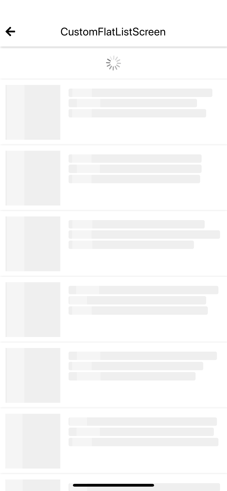
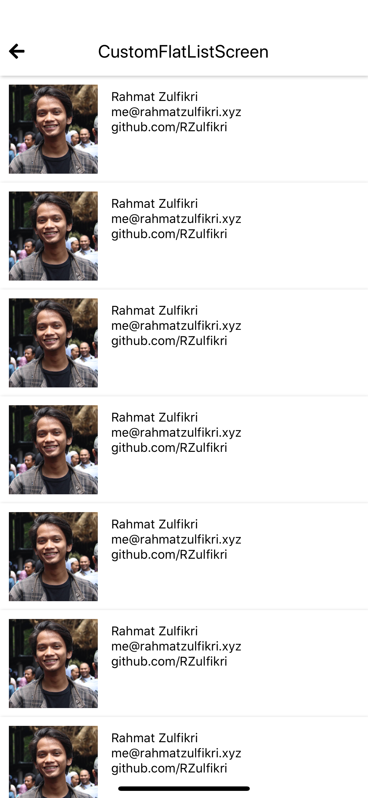
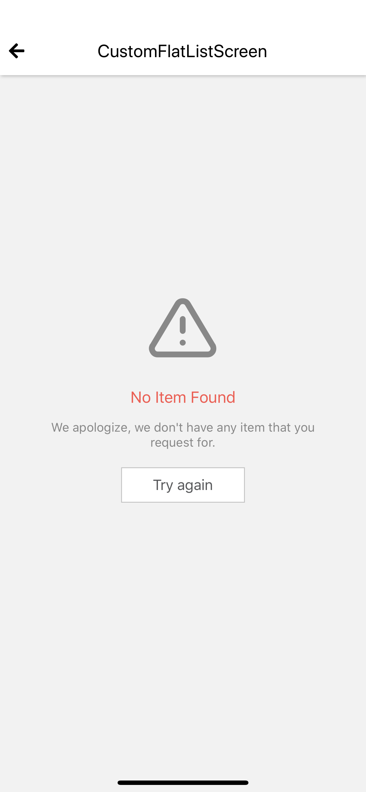
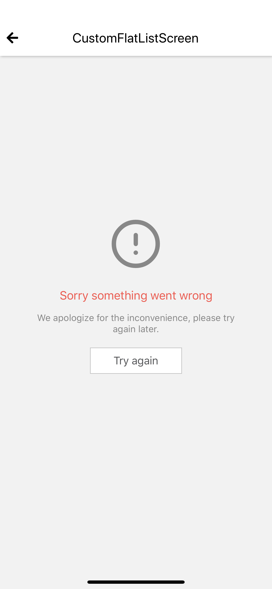
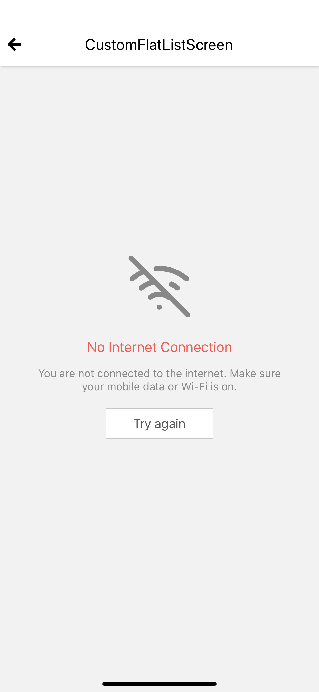

## CustomFlatlist
This is custom flatlist component, this component help you to handle `loading` state, `error` state, `no connection` state, `empty` state, `with value` state, `request` state , `refresh` state and `load-more` function.

Loading | Value    
--- | --- 
 |  

Empty | Error | No Connection
--- | --- | --
 |  | 

**How to use**

This component used in render item, and handle loading state in flatlist
```javascript
  import { Styled, PlaceholderImage, PlaceholderText } from 'react-native-awesome-component'

  const CustomFlatListItem = (props) => {
    let { data } = props
    return (
      <Styled.Container isCard padded style={{ flexDirection: 'row' }}>
        <PlaceholderImage
          uri={data.avatar}
        />
        <View style={{ marginLeft: 15, marginTop: 5, flex: 1 }}>
          <PlaceholderText numberOfLines={1}>{data.name}</PlaceholderText>
          <PlaceholderText numberOfLines={1}>{data.email}</PlaceholderText>
          <PlaceholderText numberOfLines={1}>{data.github}</PlaceholderText>
        </View>
      </Styled.Container>
    )
  }
```

This code how to use CustomFlatlist
```javascript
  import {CustomFlatList} from 'react-native-awesome-component'

  render() {
    const { getProfileListStatus, profileList, getProfileList } = this.props
    let meta = undefined

    if (!getProfileListStatus.fetching && getProfileListStatus.payload && getProfileListStatus.payload.meta) {
      meta = getProfileListStatus.payload.meta

      /**
       * Meta must be in this format
       * meta = {
       *  current_page: number;
       *  next_page: number;
       * } 
       */
      }
    }

    return (
      <CustomFlatList
        data={profileList}
        fetchFunction={getProfileList}
        meta={meta}
        loading={getProfileListStatus.fetching}
        error={getProfileListStatus.error}
        renderItem={({ item, index }) => <CustomFlatListItem key={index} data={item} />}
      />
    )
  }
```
**Global Setup**

Global const used to set global value. it used to set the style for all of this component. for more detail check [here](./global-const.md#customflatlist)

**Props**

Props | Description | Default  
--- | --- | --- 
data: any[] | props to set data that show in flatlist | []
fetchFunction: () => void | props to set fetch function, this fetchFunction used to `initial fetch`, `refresh` and `load more` | 
renderItem: () => void | props to render item in flatlist | 
renderEmpty: () => any | props to render `empty` state | `<EmptyContainer />`
renderNoConnection: () => any | props to render `no connection` state | `<NoConnectionContainer />`
renderError: () => any | props to render `error` state | `<ErrorContainer />`
placeholderCount: number | props to define amount of placeholder will displayed | 9
meta: { current_page, next_page} | props to set meta | 
