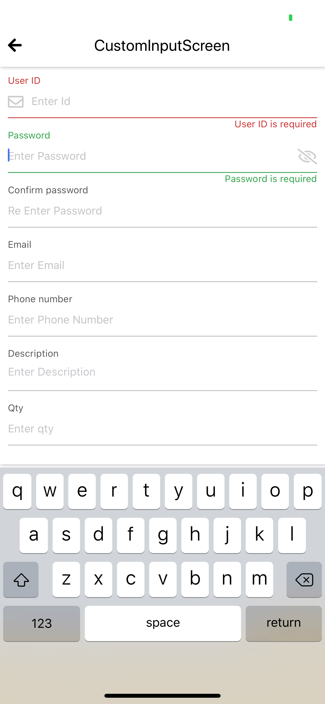

## CustomInput
This is custom `TextInput` component, this component helps on managing blur, error, input type such as `email`, `password`, `phone`, `number`, `text`, `text-area`



**How to use**

To help maintain keyboard I suggest to install `react-native-keyboard-aware-scroll-view` ([link](https://github.com/APSL/react-native-keyboard-aware-scroll-view)).
```javascript
  import { CustomInput, Styled } from 'react-native-awesome-component'
  import { KeyboardAwareScrollView } from 'react-native-keyboard-aware-scroll-view'

  class CustomInputScreen extends Component {
  constructor(props) {
    super(props)
    this.state = {
      userId: '',
      userIdError: true,
      password: '',
      confirmPassword: '',
      email: '',
      phoneNumber: '',
      description: '',
      qty: '',
      showPassword: false,
    }
  }

  render() {
    const { userId, password, confirmPassword, email, phoneNumber, description, qty, showPassword } = this.state

    return (
      <KeyboardAwareScrollView style={{ flex: 1 }} extraScrollHeight={30}>
        <Styled.Container padded isCard >
          <CustomInput
            placeholder={'Enter Id'}
            label={'User ID'}
            labelType={'top-label'}
            underlineWidth={1}
            isRequired={true}
            maxLength={10}
            minLength={5}
            value={userId}
            onChangeText={(text) => this.setState({ userId: text })}
            onChangeValidation={(status) => this.setState({userIdError: status});}
            renderLeftAction={() => {
              return (
                <View style={{ marginRight: 10 }}>
                  <Icons name={'envelope'} color={Colors.steel} size={20} />
                </View>
              )
            }}
          />
          <CustomInput
            placeholder={'Enter Password'}
            label={'Password'}
            labelType={'top-label'}
            underlineWidth={1}
            inputType={'password'}
            isRequired={true}
            value={password}
            onChangeText={(text) => this.setState({ password: text })}
            secureTextEntry={showPassword ? false : true}
            renderRightAction={() => {
              return (
                <TouchableOpacity activeOpacity={0.8} style={{ marginLeft: 10 }} onPress={() => this.setState({ showPassword: !showPassword })}>
                  <Icons name={showPassword ? 'eye' : 'eye-slash'} color={Colors.steel} size={20} />
                </TouchableOpacity>
              )
            }}
          />
          <CustomInput
            placeholder={'Re Enter Password'}
            label={'Confirm password'}
            labelType={'top-label'}
            underlineWidth={1}
            inputType={'password'}
            isRequired={true}
            value={confirmPassword}
            onChangeText={(text) => this.setState({ confirmPassword: text })}
            forceErrorMessage={password !== confirmPassword && 'Confirmation password do not match'}
          />
          <CustomInput
            placeholder={'Enter Email'}
            label={'Email'}
            labelType={'top-label'}
            underlineWidth={1}
            inputType={'email'}
            isRequired={true}
            value={email}
            onChangeText={(text) => this.setState({ email: text })}
          />
          <CustomInput
            placeholder={'Enter Phone Number'}
            label={'Phone number'}
            labelType={'top-label'}
            underlineWidth={1}
            inputType={'phone'}
            isRequired={true}
            value={phoneNumber}
            onChangeText={(text) => this.setState({ phoneNumber: text })}
          />
          <CustomInput
            placeholder={'Enter Description'}
            label={'Description'}
            labelType={'top-label'}
            underlineWidth={1}
            inputType={'text-area'}
            isRequired={true}
            value={description}
            onChangeText={(text) => this.setState({ description: text })}
          />
          <CustomInput
            placeholder={'Enter qty'}
            label={'Qty'}
            labelType={'top-label'}
            underlineWidth={1}
            inputType={'number'}
            isRequired={true}
            value={qty}
            onChangeText={(text) => this.setState({ qty: text })}
          />
        </Styled.Container>
      </KeyboardAwareScrollView>
    )
  }
}
```

**Global Setup**

Global const used to set global value. it used to set the style for all of this component. for more detail check [here](./global-const.md#custominput)

**Props**

```typescript
type CustomInputLabelType = 'top-label' | 'default' | 'left-label' | 'right-label'
type CustomInputType = 'email' | 'password' | 'phone' | 'number' | 'text' | 'text-area'
```

Basically this component using TextInput props, and adding few new props that listed below.

Props | Description | Default  
--- | --- | --- 
minLength: number | props to set min length | `undefined`
labelType: CustomInputLabelType | props to set custom input label type | `check global const`
label: string | props to set label value | `check global const`
inputType: CustomInputType | props to set type of input | `text`
labelStyle: TextStyle | props to set label style | `check global const`
errorLabelStyle: TextStyle | props to set error label style | `check global const`
underlineWidth: number | props to set underline width | `check global const`
underlineColor: string | props to set underline color | `check global const`
isRequired: boolean | props to set if input required | `false`
focusColor: string | props to set focus color | `check global const`
errorColor: string | props to set error color | `check global const`
validateOnChange: boolean | props to set, do validation if onchange trigger | `check global const`
passwordRegex: any | props to set password regex validation | `check global const`
forceErrorMessage: string | props to force show error message, if no error exist | `check global const`
errorEmail: string | props to set error message once email is invalid | `check global const`
errorPassword: string | props to set error message once password is not match with regex validation | `check global const`
errorRequired: (label: string) => string or string | props to set error of required message | `check global const`
errorMinimum: (label: string, min: number) => string or string | props to set error of minimum length message | `check global const`
errorMaximum: (label: string, max: number) => string or string | props to set error of maximum length message | `check global const`
renderLeftAction: () => any | props to render left action | `undefined`
renderRightAction: () => any | props to render right action | `undefined`
onChangeValidation: (status: boolean) => void | props to get status of validation | `true`
