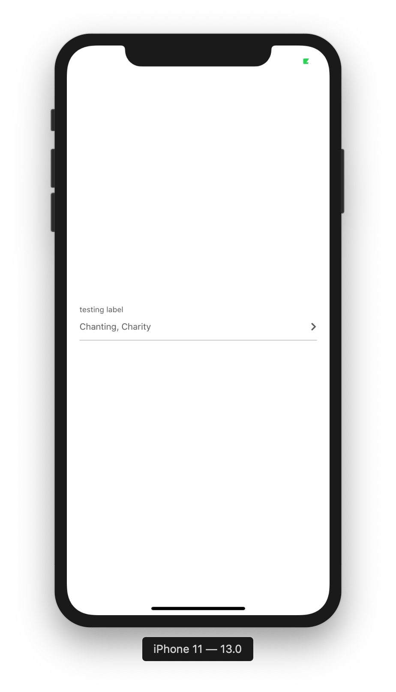
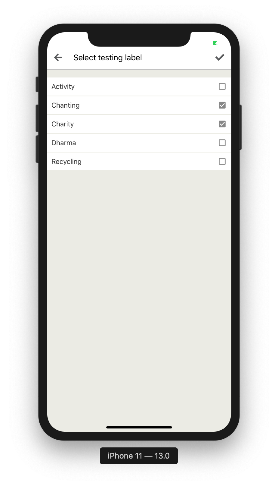

## CustomSelect

This is Picker component that can select multiple/single item.




**How to use**

```javascript
import { CustomSelect } from "react-native-awesome-component";

const dataListObject = [
  {
    id: 1,
    description: "Activity"
  },
  {
    id: 2,
    description: "Chanting"
  },
  {
    id: 3,
    description: "Charity"
  },
  {
    id: 4,
    description: "Dharma"
  },
  {
    id: 5,
    description: "Recycling"
  }
];

return (
  <CustomSelect
    placeholder="testing"
    label="testing label"
    isRequired
    data={dataList}
    multiSelect
    value={selectedValue}
    keyValue="id"
    keyDescription="description"
    onChangeValue={value => {
      // do something with value
    }}
  />
);
```

**Props**

| Props                                  | Description                                                     | Default              |
| -------------------------------------- | --------------------------------------------------------------- | -------------------- |
| placeholder: string                    | props to set placeholder text                                   | -                    |
| value: string                          | props to set value                                              | -                    |
| data: any[]                            | props to set list of data that available to pick                | []                   |
| onChangeValue: (value: string) => void | props to handle when value has changed                          | `(value) => null`    |
| textStyle: `StyleProp<TextStyle>`      | props to set style of text                                      | -                    |
| style: `StyleProp<ViewStyle>`          | props to set style of picker form                               | -                    |
| label: string                          | props to set display label                                      | -                    |
| isRequired?: boolean                   | props to set the picker is required                             | false                |
| error?: any                            | props to set error                                              | -                    |
| keyValue?: string                      | props to set key value when using array of objects              | -                    |
| keyDescription?: string                | props to set key of displayed desc. when using array of objects | -                    |
| multiSelect?: boolean                  | props to set picker is multi select mode                        | `false`              |
| multiSeparator?: string                | props to set multi select separator                             | `', '`               |
| labelType?: CustomInputLabelType       | props to set label position                                     | `top-label`          |
| selectedPickerColor?: string           | props to set colors of selected value                           | `check global const` |
| unSelectedPickerColor?: string         | props to set colors of unselected value                         | `check global const` |
