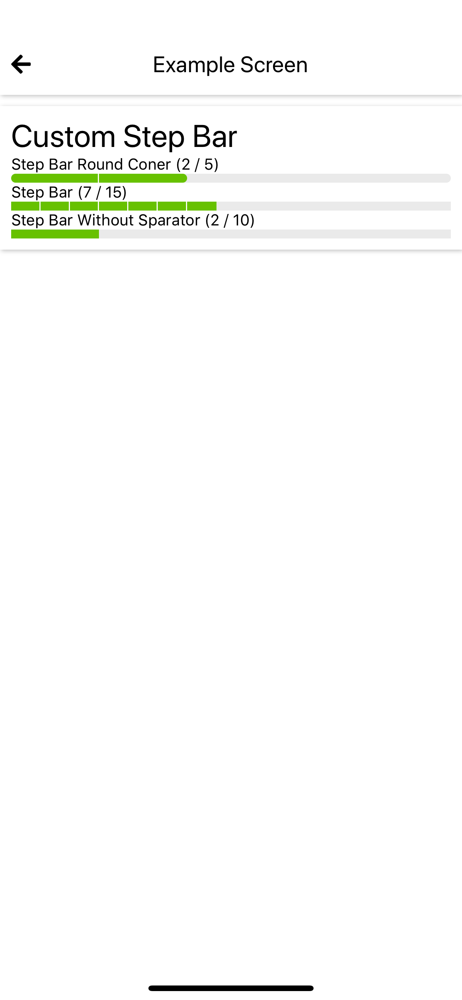

## CustomStepBar
This is custom step bar component.

 

### How to use
```javascript
import { Styled, CustomStepBar } from 'react-native-awesome-component'
...
render() {
  return (
    <Styled.Container isCard padded style={{ marginTop: 10 }}>
      <Styled.H5>
        Custom Step Bar
      </Styled.H5>
      <Styled.H2>Step Bar Round Coner (2 / 5)</Styled.H2>
      <CustomStepBar
        maxStep={5}
        currentStep={2}
      />
      <Styled.H2>Step Bar (7 / 15)</Styled.H2>
      <CustomStepBar
        maxStep={15}
        currentStep={7}
        roundCorner={false}
      />
      <Styled.H2>Step Bar Without Sparator (2 / 10)</Styled.H2>
      <CustomStepBar
        maxStep={10}
        currentStep={2}
        roundCorner={false}
        separator={false}
      />
    </Styled.Container>
  )
}

```

**Global Setup**

Global const used to set global value. it used to set the style for all of this component. for more detail check [here](./global-const.md#customstepbar)

### Props
Props | Description | Default  
--- | --- | --- 
maxStep: number | props to set max step | `2`
currentStep: number | props to set current step | `0`
roundCorner: boolean | props to set round corner | `true`
separator: boolean | props to set separator | `true`
activeColor: string | props to set active color | `#67c100`
inactiveColor: string | props to set inactive color | `#eaeaea`