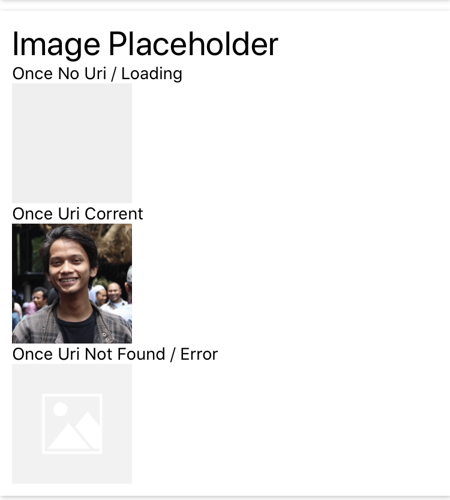

## PlaceholderImage
This is Image component with placholder. This component have 3 state (`loading`, `success`, `error`).



**Hot to use**
```javascript
import {PlaceholderImage} from 'react-native-awesome-component`
return(
  <PlaceholderImage uri={''} /> // loading
  <PlaceholderImage uri={'http://rahmatzulfikri.xyz/images/avatar.jpg'} /> // success
  <PlaceholderImage uri={'http://rahmatzulfikri.xyz/images/avatar2.jpg'} /> // error
)
```

**Props**

Props | Description | Default  
--- | --- | --- 
uri: string | props to set image uri | -
width: number | props to set image with | `100`
height: number | props to set image height | `100`
radius: number | props to set image radius | -
borderWidth: number | props to set image border width | `0`
borderColor: string | props to set image border color | `#000000`
defaultSource: string | props to set default image when image not found / not valid | `./placeholder-image`
resizeMethod: ResizeMethodType | props to set resizeMethod | `"auto" | "resize" | "scale"`
resizeMode: ResizeModeType | props to set resizeMode | `"cover" | "contain" | "stretch" | "repeat" | "center"`
isCard: boolean | props to set image as card / set shadow | false
