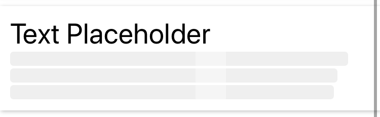

## PlaceholderText
This is Text component with placeholder. This component have 2 state (`with value`, `loading / without value`).




**How to use**
```
import {PlaceholderText} from 'react-native-awesome-component`

return(
  <PlaceholderText>{this.state.text}</PlaceholderText> // show text
  <PlaceholderText>''</PlaceholderText> // show loading
)
```

**Props**

Same as `<Text/>` props