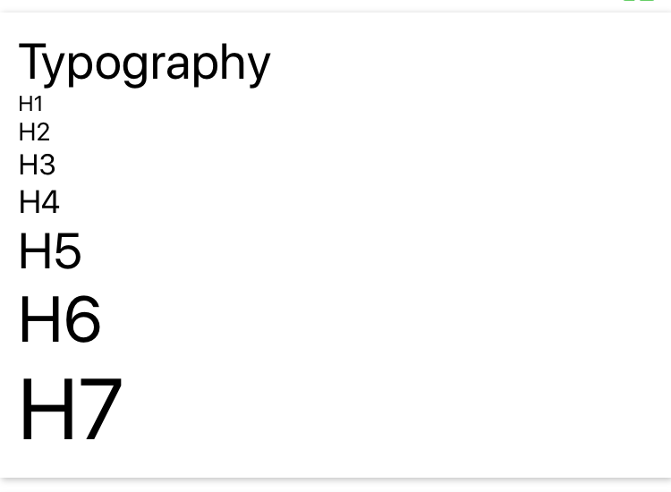

## Styled
This is custom styled component, kind of components with default style.



**How to use**

```
import {Styled} from 'react-native-awesome-component

return(
  <Styled.Component isCard={true} />
  <Styled.H1>HELLO</Styled.H1>
)
```
**Props**

Name | Description | Props  
--- | --- | --- 
Container | Styled <View/> Component | `<View/>` props <br />`isCard: boolean` to set view as card<br />`padded: boolean` to set view using padding or not<br />`padding: number` to set value of padding<br />`disableVerticalPadding: boolean` to disable vertical padding<br />`disableHorizontalPadding: boolean` to disable horizontal padding
FlexContainer | Styled `<Container/>` with flex = 1 | same as `<Container/>` props
SafeContainer | Styled `<SafeAreaView/>` | same as `<Container/>` props
TouchableContainer | Styled `<TouchableOpacity/>` | same as `<Container/>` props
H1 | Styled `<Text/>` with H1 size | same as `<Text/>` props
H2 | Styled `<Text/>` with H2 size | same as `<Text/>` props
H3 | Styled `<Text/>` with H3 size | same as `<Text/>` props
H4 | Styled `<Text/>` with H4 size | same as `<Text/>` props
H5 | Styled `<Text/>` with H5 size | same as `<Text/>` props
H6 | Styled `<Text/>` with H6 size | same as `<Text/>` props
H7 | Styled `<Text/>` with H7 size | same as `<Text/>` props